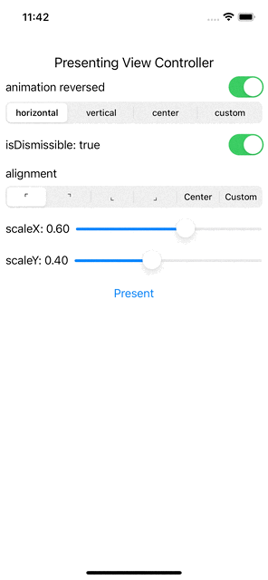

### [README of Chinese](./README.md)

# HCCPopup

[](https://img.shields.io/badge/Swift-5-Orange?style=flat-square)
[](https://img.shields.io/badge/Platforms-iOS_9.0+-yellowgreen?style=flat-square)
[](https://img.shields.io/badge/Version-0.1.0-blue?style=flat-square)
[](https://cocoapods.org/)
[](https://img.shields.io/badge/License-Apache_2.0-green?style=flat-square)


## 关于
' UIViewControllerTransitioningDelegate '的语法库。

来自苹果的相关文档: [*Creating Custom Presentations*](https://developer.apple.com/library/archive/featuredarticles/ViewControllerPGforiPhoneOS/DefiningCustomPresentations.html)
## 截图


## 示例
要运行示例项目，请克隆repo，并首先从example目录运行pod install。
## 版本
### 1.0.0
- [x] 预定义对齐: `topLeft`, `topRight`, `bottomLeft`, `bottomRight`, `center`
- [x] 自定义对齐: `custom`
- [x] 预定义动画: `horizontal`, `vertical`, `center`, `reversed`
- [ ] 自定义动画；支持自定义 `CGAffineTransform`

## 文档 
### 要求
iOS 9.0+

swift 5+
### Installation

HCCPopup is a [Private Pod](https://github.com/hccxc/ios-popup.git) for now. To install
it, simply add the following line to your Podfile:

```ruby
pod 'HCCPopup' , :git => 'https://github.com/hccxc/ios-popup.git'
```
### Usage
#### Popup.Alignment
The `.custom(x:y:)` case in a rectangle with height `h` and width `w` describes the `origin` point `(x * w/2 + w/2, y * h/2 + h/2)` in the coordinate system of the rectangle.
#### Popup
```swift
// Hold your `Popup`
let popup = Popup()
popup.configuration = .init(isDismissible: isDismissible, alignment: alignment, scaleX: scaleX, scaleY: scaleY, animation: animation)
// For `presentedViewController`
// Set `Popup` as `transitioningDelegate` of `presentedViewController`
// Set `modalPresentationStyle` to `.custom`
presented.transitioningDelegate = popup
presented.modalPresentationStyle = .custom
someViewController.present(presented, animated: true)
```
### UIViewController extension
```swift
let viewController = UIViewController()
let config = Popup.Configuration(isDismissible: isDismissible, alignment: alignment, scaleX: scaleX, scaleY: scaleY, animation: animation)
// `pup` is a readonly `Popup` instance
viewController.pup(config).present(vcToPresent, animated: true)
```
## License
HCCPopup在Apache 2.0许可下可用。更多信息请参见LICENSE文件。